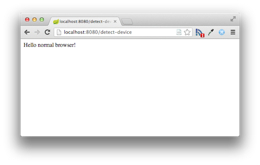
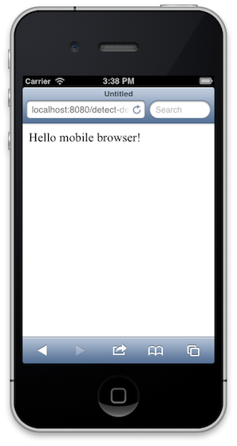
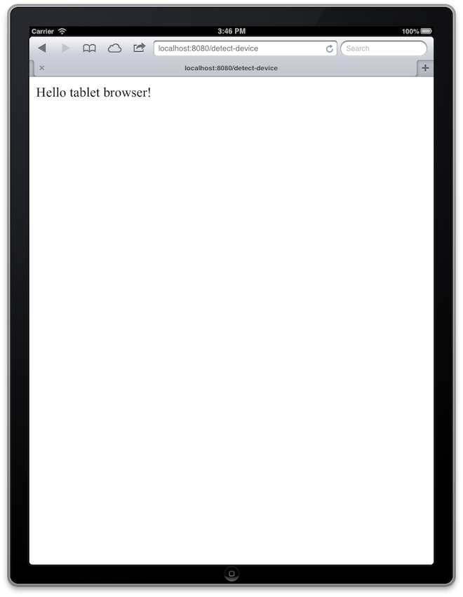

:spring_version: current
:spring_boot_version: 1.3.5.RELEASE
:DeviceHandlerMethodArgumentResolver: http://docs.spring.io/spring-mobile/docs/1.1.x/api/org/springframework/mobile/device/DeviceHandlerMethodArgumentResolver.html
:Configuration: http://docs.spring.io/spring/docs/{spring_version}/javadoc-api/org/springframework/context/annotation/Configuration.html
:SpringApplication: http://docs.spring.io/spring-boot/docs/{spring_boot_version}/api/org/springframework/boot/SpringApplication.html
:DeviceResolverHandlerInterceptor: http://docs.spring.io/spring-mobile/docs/1.1.x/api/org/springframework/mobile/device/DeviceResolverHandlerInterceptor.html
:Device: http://docs.spring.io/spring-mobile/docs/1.1.x/api/org/springframework/mobile/device/Device.html
:HandlerInterceptor: http://docs.spring.io/spring/docs/{spring_version}/javadoc-api/org/springframework/web/servlet/HandlerInterceptor.html
:DispatcherServlet: http://docs.spring.io/spring/docs/{spring_version}/javadoc-api/org/springframework/web/servlet/DispatcherServlet.html
:WebMvcConfigurerAdapter: http://docs.spring.io/spring/docs/{spring_version}/javadoc-api/org/springframework/web/servlet/config/annotation/WebMvcConfigurerAdapter.html
:ResponseBody: http://docs.spring.io/spring/docs/{spring_version}/javadoc-api/org/springframework/web/bind/annotation/ResponseBody.html
:toc:
:icons: font
:source-highlighter: prettify
:project_id: gs-device-detection
This guide walks you through the process of using Spring to detect the type of device that is accessing your web site.

== What you'll build

You'll create a Spring MVC application that detects the type of device that is accessing your web site and that switches views dynamically based on that device type.

== What you'll need

:java_version: 1.8
include::https://raw.githubusercontent.com/spring-guides/getting-started-macros/master/prereq_editor_jdk_buildtools.adoc[]

include::https://raw.githubusercontent.com/spring-guides/getting-started-macros/master/how_to_complete_this_guide.adoc[]

include::https://raw.githubusercontent.com/spring-guides/getting-started-macros/master/hide-show-gradle.adoc[]

include::https://raw.githubusercontent.com/spring-guides/getting-started-macros/master/hide-show-maven.adoc[]

include::https://raw.githubusercontent.com/spring-guides/getting-started-macros/master/hide-show-sts.adoc[]

[[initial]]
== Auto-configuration

By including the Spring Mobile dependency, Spring Boot configures a {DeviceResolverHandlerInterceptor}[`DeviceResolverHandlerInterceptor`] and {DeviceHandlerMethodArgumentResolver}[`DeviceHandlerMethodArgumentResolver`] automatically. {DeviceResolverHandlerInterceptor}[`DeviceResolverHandlerInterceptor`] examines the `User-Agent` header in the incoming request, and based on the header value, determines whether the request is coming from a normal (desktop) browser, a mobile (phone) browser, or a tablet browser. The {DeviceHandlerMethodArgumentResolver}[`DeviceHandlerMethodArgumentResolver`] allows Spring MVC to use the resolved {Device}[`Device`] object in a controller method.

== Create a web controller

In Spring, web endpoints are simply Spring MVC controllers. The following Spring MVC controller handles a GET request and returns a String indicating the type of the device:

`src/main/java/hello/DeviceDetectionController.java`
[source,java]
----
include::complete/src/main/java/hello/DeviceDetectionController.java[]
----

For this example, rather than rely on a view (such as JSP) to render model data in HTML, this controller simply returns the data to be written directly to the body of the response. In this case, the data is a String that reads "Hello mobile browser!" if the requesting client is a mobile device. The {ResponseBody}[`@ResponseBody`] annotation tells Spring MVC to write the returned object into the response body, rather than to render a model into a view.

== Make the application executable

Although it is possible to package this service as a traditional link:/understanding/WAR[WAR] file for deployment to an external application server, the simpler approach demonstrated in the next section creates a _standalone application_. You package everything in a single, executable JAR file, driven by a good old Java `main()` method. And along the way, you use Spring's support for embedding the link:/understanding/Tomcat[Tomcat] servlet container as the HTTP runtime, instead of deploying to an external instance.

`src/main/java/hello/Application.java`
[source,java]
----
include::complete/src/main/java/hello/Application.java[]
----

`@SpringBootApplication` is a convenience annotation that adds all of the following:
    
- `@Configuration` tags the class as a source of bean definitions for the application context.
- `@EnableAutoConfiguration` tells Spring Boot to start adding beans based on classpath settings, other beans, and various property settings.
- Normally you would add `@EnableWebMvc` for a Spring MVC app, but Spring Boot adds it automatically when it sees **spring-webmvc** on the classpath. This flags the application as a web application and activates key behaviors such as setting up a `DispatcherServlet`.
- `@ComponentScan` tells Spring to look for other components, configurations, and services in the the `hello` package, allowing it to find the `HelloController`.

The `main()` method uses Spring Boot's `SpringApplication.run()` method to launch an application. Did you notice that there wasn't a single line of XML? No **web.xml** file either. This web application is 100% pure Java and you didn't have to deal with configuring any plumbing or infrastructure.

include::https://raw.githubusercontent.com/spring-guides/getting-started-macros/master/build_an_executable_jar_subhead.adoc[]

include::https://raw.githubusercontent.com/spring-guides/getting-started-macros/master/build_an_executable_jar_with_both.adoc[]

Logging output is displayed. The service should be up and running within a few seconds.

== Test the service

To test the application, point your browser at http://localhost:8080/detect-device. In a normal desktop browser, you should see something like this:

If you point a mobile browser at the same URL (such as the iOS Simulator's browser), you should see something like this (you may have to zoom in on the mobile browser to read the message clearly):

If you point a tablet browser at the URL, you should see something like this:

Note that if you want to use a real mobile device to test this controller, it will not work with the localhost server. You'll need to find the name of your machine on your network and use that instead of localhost.

== Summary

Congratulations! You have just developed a simple web page that detects the type of device being used by a client.

include::https://raw.githubusercontent.com/spring-guides/getting-started-macros/master/footer.adoc[]

